# Velocis - Complete Architecture Diagram

This document contains a comprehensive Mermaid architecture diagram for the Velocis AI Engineering Platform.

---

## Complete System Architecture

```mermaid
graph TB
    subgraph "Client Layer - React SPA"
        FE[React 18.3.1 Frontend<br/>Vite 6.4.1 + TypeScript 5.9.3]
        
        subgraph "UI Components"
            PAGES[Pages Layer<br/>HomePage, DashboardPage<br/>RepositoryPage, CortexPage<br/>WorkspacePage, PipelinePage<br/>InfrastructurePage]
            SHARED[Shared Components<br/>Radix UI + Tailwind CSS<br/>MetricCard, StatusChip<br/>EmptyState, Buttons]
            UI_LIB[UI Libraries<br/>Monaco Editor 4.7.0<br/>React Three Fiber 8.18.0<br/>ReactFlow 11.11.4<br/>Recharts 2.15.2<br/>Framer Motion 12.34.3]
        end
        
        subgraph "State & Services"
            AUTH_CTX[Auth Context<br/>JWT + Session Management]
            THEME[Theme Provider<br/>Dark/Light Mode]
            API_CLIENT[API Client<br/>Axios + Fetch]
        end
    end
    
    subgraph "API Gateway Layer"
        AG_PROD[AWS API Gateway<br/>Production Environment<br/>Custom Domain: api.velocis.dev]
        AG_LOCAL[Express 5.2.1 Server<br/>Local Development<br/>Port 3001]
        
        subgraph "Middleware Stack"
            CORS[CORS Handler<br/>Origin Validation]
            JWT_AUTH[JWT Authentication<br/>Bearer Token Validation]
            WEBHOOK_SIG[Webhook Signature<br/>HMAC Verification]
            RATE_LIMIT[Rate Limiting<br/>Per-User Throttling]
        end
    end
    
    subgraph "Application Layer - Lambda Functions"
        subgraph "Authentication Services"
            AUTH_GITHUB[GitHub OAuth Flow<br/>authGithub.ts<br/>authGithubCallback.ts]
            AUTH_JWT[JWT Token Management<br/>auth.ts]
            GET_ME[User Profile<br/>getMe.ts]
        end
        
        subgraph "Repository Management"
            GET_REPOS[List Repositories<br/>getRepos.ts<br/>getGithubRepos.ts]
            INSTALL[Repository Installation<br/>installRepo.ts<br/>Webhook Registration]
            REPO_OVERVIEW[Repository Overview<br/>getRepoOverview.ts]
            REPO_SETTINGS[Repository Settings<br/>getRepoSettings.ts<br/>updateRepoSettings.ts]
            DELETE_REPO[Delete Repository<br/>deleteRepo.ts]
        end
        
        subgraph "🛡️ Sentinel Agent - Code Review AI"
            SENTINEL_CORE[analyzeLogic.ts<br/>DeepSeek V3.2 via Bedrock<br/>Semantic Code Review]
            SENTINEL_API[Sentinel API Handlers<br/>getSentinelData.ts<br/>List PRs, PR Details<br/>Trigger Scan, Activity]
            SENTINEL_MENTOR[mentorChat.ts<br/>Multilingual AI Mentor<br/>EN/HI/TA/TE/KN/MR/BN]
            
            SENTINEL_CORE --> SENTINEL_API
            SENTINEL_MENTOR --> SENTINEL_CORE
        end
        
        subgraph "🏰 Fortress Agent - QA Automation"
            FORTRESS_CORE[analyzeFortress.ts<br/>DeepSeek V3.2 via Bedrock<br/>BDD Test Plan Generation]
            FORTRESS_API[Fortress API Handlers<br/>getPipelineData.ts<br/>Pipeline Status, Runs<br/>Trigger Pipeline]
            FORTRESS_TDD[TDD Loop Orchestration<br/>AWS Step Functions<br/>fortress-tdd-loop.asl.json]
            
            FORTRESS_CORE --> FORTRESS_API
            FORTRESS_TDD --> FORTRESS_CORE
        end
        
        subgraph "🧠 Cortex Agent - Service Topology"
            CORTEX_GRAPH[graphBuilder.ts<br/>Repository Analysis<br/>Dependency Graph Builder]
            CORTEX_SYNC[syncCortexServices.ts<br/>Service Discovery<br/>Health Monitoring]
            CORTEX_API[Cortex API Handlers<br/>getCortexServices.ts<br/>getCortexData.ts<br/>Service Map, Timeline]
            CORTEX_REBUILD[rebuildCortex.ts<br/>Manual Rebuild Trigger]
            
            CORTEX_GRAPH --> CORTEX_API
            CORTEX_SYNC --> CORTEX_GRAPH
            CORTEX_REBUILD --> CORTEX_GRAPH
        end
        
        subgraph "💻 Workspace - AI Code Editor"
            WORKSPACE_API[getWorkspaceData.ts<br/>File Browser, Content<br/>Annotations, Chat<br/>Push, Review]
            WORKSPACE_CHAT[AI Chat Integration<br/>Bedrock Streaming<br/>Context-Aware Responses]
            
            WORKSPACE_CHAT --> WORKSPACE_API
        end
        
        subgraph "🏗️ Infrastructure Predictor"
            IAC_PREDICTOR[generateIac.ts<br/>Terraform Generation<br/>CloudFormation Templates]
            IAC_API[Infrastructure API<br/>getInfrastructureData.ts<br/>predictInfrastructure.ts]
            COST_FORECAST[getCostForecast.ts<br/>AWS Pricing API<br/>Multi-Environment Costs]
            
            IAC_PREDICTOR --> IAC_API
            COST_FORECAST --> IAC_API
        end
        
        subgraph "Dashboard & Activity"
            DASHBOARD[getDashboard.ts<br/>Aggregate Repository Data<br/>System Metrics]
            ACTIVITY[getActivity.ts<br/>Cross-Repo Activity Feed<br/>Event Aggregation]
            SYSTEM_HEALTH[getSystemHealth.ts<br/>Platform Health Metrics<br/>Agent Uptime]
            AUTOMATION[Automation Services<br/>getAutomationReport.ts<br/>triggerAutomation.ts]
        end
        
        subgraph "Webhook Handlers"
            WEBHOOK_PUSH[githubPush.ts<br/>Push Event Handler<br/>Triggers All Agents]
        end
    end
    
    subgraph "Integration Layer - External Services"
        subgraph "GitHub Integration"
            GITHUB_API[GitHub REST API<br/>Octokit 22.0.1]
            GITHUB_OAUTH[GitHub OAuth 2.0<br/>Authorization Flow]
            GITHUB_WEBHOOKS[GitHub Webhooks<br/>Push, PR, Deployment Events]
            
            subgraph "GitHub Operations"
                REPO_OPS[repoOps.ts<br/>fetchRepoTree<br/>fetchFileContent<br/>postPullRequestComment]
                AUTH_OPS[auth.ts<br/>OAuth Token Exchange<br/>Token Refresh]
            end
        end
        
        subgraph "AWS Bedrock - AI Models"
            BEDROCK_CLIENT[bedrockClient.ts<br/>BedrockRuntimeClient<br/>Region: us-east-1]
            
            subgraph "AI Models"
                DEEPSEEK[DeepSeek V3.2<br/>Code Review & Analysis<br/>Test Generation<br/>IaC Generation]
                NOVA[Nova Pro<br/>Architecture Analysis<br/>Infrastructure Prediction]
            end
            
            BEDROCK_CLIENT --> DEEPSEEK
            BEDROCK_CLIENT --> NOVA
        end
        
        subgraph "AWS Services"
            TRANSLATE[AWS Translate<br/>translate.ts<br/>Multilingual Support<br/>EN→HI/TA/TE/KN/MR/BN]
            PRICING[AWS Pricing API<br/>Cost Calculation<br/>Service Pricing Lookup]
            STEP_FN[AWS Step Functions<br/>TDD Loop Orchestration<br/>Workflow State Machine]
        end
    end
    
    subgraph "Data Layer - Amazon DynamoDB"
        subgraph "User & Repository Tables"
            TBL_USERS[(velocis-users<br/>PK: userId<br/>User Profiles)]
            TBL_REPOS[(velocis-repos<br/>PK: repoId<br/>Repository Metadata)]
            TBL_INSTALL[(velocis-installations<br/>PK: jobId<br/>Installation Status)]
        end
        
        subgraph "Agent Data Tables"
            TBL_SENTINEL[(velocis-sentinel<br/>PK: id<br/>Code Review Findings<br/>PR Risk Scores)]
            TBL_PIPELINE[(velocis-pipeline-runs<br/>PK: runId<br/>Fortress TDD Results<br/>Test Execution History)]
            TBL_CORTEX[(velocis-cortex<br/>PK: id<br/>Service Topology Graph<br/>Dependency Metadata)]
        end
        
        subgraph "Activity & Monitoring Tables"
            TBL_ACTIVITY[(velocis-activity<br/>PK: id<br/>Event Log<br/>Agent Actions)]
            TBL_TIMELINE[(velocis-timeline<br/>PK: id<br/>Deployment Timeline<br/>Historical Events)]
            TBL_DEPLOYS[(velocis-deployments<br/>PK: id<br/>Deployment Records)]
            TBL_HEALTH[(velocis-system-health<br/>PK: id<br/>Platform Metrics)]
        end
        
        subgraph "Workspace & Infrastructure Tables"
            TBL_ANNOTATIONS[(velocis-annotations<br/>PK: id<br/>Code Annotations<br/>Inline Warnings)]
            TBL_CHAT[(velocis-workspace-chat<br/>PK: messageId<br/>Chat History)]
            TBL_IAC[(velocis-iac<br/>PK: id<br/>Generated IaC Code)]
            TBL_IAC_JOBS[(velocis-iac-jobs<br/>PK: jobId<br/>IaC Generation Jobs)]
        end
        
        DYNAMO_CLIENT[dynamoClient.ts<br/>DynamoDBDocumentClient<br/>PAY_PER_REQUEST Billing]
        
        DYNAMO_CLIENT --> TBL_USERS
        DYNAMO_CLIENT --> TBL_REPOS
        DYNAMO_CLIENT --> TBL_INSTALL
        DYNAMO_CLIENT --> TBL_SENTINEL
        DYNAMO_CLIENT --> TBL_PIPELINE
        DYNAMO_CLIENT --> TBL_CORTEX
        DYNAMO_CLIENT --> TBL_ACTIVITY
        DYNAMO_CLIENT --> TBL_TIMELINE
        DYNAMO_CLIENT --> TBL_DEPLOYS
        DYNAMO_CLIENT --> TBL_HEALTH
        DYNAMO_CLIENT --> TBL_ANNOTATIONS
        DYNAMO_CLIENT --> TBL_CHAT
        DYNAMO_CLIENT --> TBL_IAC
        DYNAMO_CLIENT --> TBL_IAC_JOBS
    end
    
    subgraph "Infrastructure as Code"
        subgraph "AWS SAM Deployment"
            SAM_TEMPLATE[template.yaml<br/>CloudFormation Template<br/>Lambda Functions<br/>API Gateway<br/>DynamoDB Tables]
        end
        
        subgraph "AWS CDK Deployment"
            CDK_STACK[velocis-cdk-infra-stack.ts<br/>Alternative IaC<br/>Experimental]
        end
    end
    
    subgraph "Utilities & Services"
        CONFIG[config.ts<br/>Environment Variables<br/>AWS Region Configuration]
        LOGGER[logger.ts<br/>Pino Structured Logging<br/>CloudWatch Integration]
        API_RESPONSE[apiResponse.ts<br/>Standardized Response Format]
        CODE_EXTRACTOR[codeExtractor.ts<br/>Markdown Code Fence Stripper]
        ACTIVITY_LOGGER[activityLogger.ts<br/>Event Tracking Helper]
    end
    
    %% Client to API Gateway
    FE --> AG_PROD
    FE --> AG_LOCAL
    PAGES --> API_CLIENT
    API_CLIENT --> AUTH_CTX
    
    %% API Gateway to Application Layer
    AG_PROD --> CORS
    AG_LOCAL --> CORS
    CORS --> JWT_AUTH
    CORS --> WEBHOOK_SIG
    JWT_AUTH --> RATE_LIMIT
    
    %% Authentication Flow
    RATE_LIMIT --> AUTH_GITHUB
    RATE_LIMIT --> AUTH_JWT
    RATE_LIMIT --> GET_ME
    AUTH_GITHUB --> GITHUB_OAUTH
    
    %% Repository Management Flow
    RATE_LIMIT --> GET_REPOS
    RATE_LIMIT --> INSTALL
    RATE_LIMIT --> REPO_OVERVIEW
    RATE_LIMIT --> REPO_SETTINGS
    RATE_LIMIT --> DELETE_REPO
    
    %% Sentinel Agent Flow
    RATE_LIMIT --> SENTINEL_API
    SENTINEL_API --> SENTINEL_CORE
    SENTINEL_CORE --> BEDROCK_CLIENT
    SENTINEL_CORE --> TRANSLATE
    SENTINEL_CORE --> REPO_OPS
    SENTINEL_CORE --> DYNAMO_CLIENT
    
    %% Fortress Agent Flow
    RATE_LIMIT --> FORTRESS_API
    FORTRESS_API --> FORTRESS_CORE
    FORTRESS_CORE --> BEDROCK_CLIENT
    FORTRESS_TDD --> STEP_FN
    FORTRESS_API --> DYNAMO_CLIENT
    
    %% Cortex Agent Flow
    RATE_LIMIT --> CORTEX_API
    CORTEX_API --> CORTEX_GRAPH
    CORTEX_GRAPH --> REPO_OPS
    CORTEX_GRAPH --> BEDROCK_CLIENT
    CORTEX_GRAPH --> DYNAMO_CLIENT
    RATE_LIMIT --> CORTEX_REBUILD
    
    %% Workspace Flow
    RATE_LIMIT --> WORKSPACE_API
    WORKSPACE_API --> WORKSPACE_CHAT
    WORKSPACE_CHAT --> BEDROCK_CLIENT
    WORKSPACE_API --> REPO_OPS
    WORKSPACE_API --> DYNAMO_CLIENT
    
    %% Infrastructure Predictor Flow
    RATE_LIMIT --> IAC_API
    IAC_API --> IAC_PREDICTOR
    IAC_PREDICTOR --> BEDROCK_CLIENT
    IAC_API --> COST_FORECAST
    COST_FORECAST --> PRICING
    IAC_API --> DYNAMO_CLIENT
    
    %% Dashboard & Activity Flow
    RATE_LIMIT --> DASHBOARD
    RATE_LIMIT --> ACTIVITY
    RATE_LIMIT --> SYSTEM_HEALTH
    RATE_LIMIT --> AUTOMATION
    DASHBOARD --> DYNAMO_CLIENT
    ACTIVITY --> DYNAMO_CLIENT
    SYSTEM_HEALTH --> DYNAMO_CLIENT
    
    %% Webhook Flow
    WEBHOOK_SIG --> WEBHOOK_PUSH
    WEBHOOK_PUSH --> SENTINEL_CORE
    WEBHOOK_PUSH --> FORTRESS_CORE
    WEBHOOK_PUSH --> CORTEX_GRAPH
    WEBHOOK_PUSH --> IAC_PREDICTOR
    WEBHOOK_PUSH --> ACTIVITY_LOGGER
    GITHUB_WEBHOOKS -.Push Events.-> WEBHOOK_SIG
    
    %% GitHub Integration
    REPO_OPS --> GITHUB_API
    AUTH_OPS --> GITHUB_API
    INSTALL --> GITHUB_WEBHOOKS
    
    %% Utilities
    SENTINEL_CORE --> LOGGER
    FORTRESS_CORE --> LOGGER
    CORTEX_GRAPH --> LOGGER
    WORKSPACE_API --> LOGGER
    IAC_PREDICTOR --> LOGGER
    
    SENTINEL_API --> API_RESPONSE
    FORTRESS_API --> API_RESPONSE
    CORTEX_API --> API_RESPONSE
    WORKSPACE_API --> API_RESPONSE
    IAC_API --> API_RESPONSE
    
    SENTINEL_CORE --> CODE_EXTRACTOR
    FORTRESS_CORE --> CODE_EXTRACTOR
    
    WEBHOOK_PUSH --> ACTIVITY_LOGGER
    ACTIVITY_LOGGER --> TBL_ACTIVITY
    
    %% All services use config
    AUTH_GITHUB --> CONFIG
    SENTINEL_CORE --> CONFIG
    FORTRESS_CORE --> CONFIG
    CORTEX_GRAPH --> CONFIG
    WORKSPACE_API --> CONFIG
    IAC_PREDICTOR --> CONFIG
    DYNAMO_CLIENT --> CONFIG
    BEDROCK_CLIENT --> CONFIG
    
    %% Styling
    classDef sentinel fill:#8b5cf6,stroke:#7c3aed,color:#fff
    classDef fortress fill:#ef4444,stroke:#dc2626,color:#fff
    classDef cortex fill:#10b981,stroke:#059669,color:#fff
    classDef workspace fill:#3b82f6,stroke:#2563eb,color:#fff
    classDef predictor fill:#f59e0b,stroke:#d97706,color:#fff
    classDef database fill:#6366f1,stroke:#4f46e5,color:#fff
    classDef external fill:#64748b,stroke:#475569,color:#fff
    classDef frontend fill:#06b6d4,stroke:#0891b2,color:#fff
    
    class SENTINEL_CORE,SENTINEL_API,SENTINEL_MENTOR sentinel
    class FORTRESS_CORE,FORTRESS_API,FORTRESS_TDD fortress
    class CORTEX_GRAPH,CORTEX_SYNC,CORTEX_API,CORTEX_REBUILD cortex
    class WORKSPACE_API,WORKSPACE_CHAT workspace
    class IAC_PREDICTOR,IAC_API,COST_FORECAST predictor
    class TBL_USERS,TBL_REPOS,TBL_INSTALL,TBL_SENTINEL,TBL_PIPELINE,TBL_CORTEX,TBL_ACTIVITY,TBL_TIMELINE,TBL_DEPLOYS,TBL_HEALTH,TBL_ANNOTATIONS,TBL_CHAT,TBL_IAC,TBL_IAC_JOBS,DYNAMO_CLIENT database
    class GITHUB_API,GITHUB_OAUTH,GITHUB_WEBHOOKS,REPO_OPS,AUTH_OPS,BEDROCK_CLIENT,DEEPSEEK,NOVA,TRANSLATE,PRICING,STEP_FN external
    class FE,PAGES,SHARED,UI_LIB,AUTH_CTX,THEME,API_CLIENT frontend
```



---

## Technology Stack Summary

### Frontend Stack
- **Framework**: React 18.3.1 with TypeScript 5.9.3
- **Build Tool**: Vite 6.4.1
- **Routing**: React Router 7.13.0
- **UI Components**: Radix UI (Accessible Primitives)
- **Styling**: Tailwind CSS 4.1.12
- **Animation**: Framer Motion 12.34.3, GSAP 3.14.2
- **Code Editor**: Monaco Editor 4.7.0
- **3D Graphics**: React Three Fiber 8.18.0, Three.js 0.167.1
- **Diagrams**: ReactFlow 11.11.4
- **Charts**: Recharts 2.15.2

### Backend Stack
- **Runtime**: Node.js 20.x (ARM64)
- **Language**: TypeScript 5.9.3
- **Local Server**: Express 5.2.1
- **Production**: AWS Lambda (Serverless)
- **API Gateway**: AWS API Gateway (Production), Express (Local)
- **Logging**: Pino 10.3.1
- **Validation**: Zod 4.3.6
- **GitHub Client**: Octokit 22.0.1
- **Authentication**: jsonwebtoken 9.0.2

### AWS Infrastructure
- **Compute**: AWS Lambda (Node.js 20.x, ARM64, 256MB)
- **API**: AWS API Gateway (REST API)
- **Database**: Amazon DynamoDB (14 Tables, PAY_PER_REQUEST)
- **AI Models**: AWS Bedrock (DeepSeek V3.2, Nova Pro)
- **Translation**: AWS Translate (7 Languages)
- **Orchestration**: AWS Step Functions (TDD Loop)
- **Pricing**: AWS Pricing API (Cost Forecasting)
- **IaC**: AWS SAM + CloudFormation, AWS CDK (Experimental)

### AI Models
- **DeepSeek V3.2**: Code review, security analysis, test generation, IaC generation
- **Nova Pro**: Architecture analysis, infrastructure prediction
- **Temperature**: 0.1-0.3 (deterministic outputs)
- **Max Tokens**: 2000-8000 (based on task complexity)
- **Region**: us-east-1

### Database Schema (DynamoDB)
1. **velocis-users**: User profiles and authentication
2. **velocis-repos**: Repository metadata and settings
3. **velocis-installations**: Installation job tracking
4. **velocis-sentinel**: Code review findings and PR risk scores
5. **velocis-pipeline-runs**: Fortress TDD results and test history
6. **velocis-cortex**: Service topology graphs and dependencies
7. **velocis-activity**: Event log and agent actions
8. **velocis-timeline**: Deployment timeline and historical events
9. **velocis-deployments**: Deployment records
10. **velocis-system-health**: Platform health metrics
11. **velocis-annotations**: Code annotations and inline warnings
12. **velocis-workspace-chat**: AI chat history
13. **velocis-iac**: Generated IaC code (Terraform/CloudFormation)
14. **velocis-iac-jobs**: IaC generation job tracking

---

## Key Architectural Patterns

### 1. Serverless-First Design
- AWS Lambda for all compute (auto-scaling, pay-per-request)
- DynamoDB PAY_PER_REQUEST billing mode
- No server management or patching required
- ARM64 architecture for 20% cost reduction

### 2. Event-Driven Architecture
- GitHub webhooks trigger automated workflows
- Asynchronous processing for long-running tasks
- Event sourcing for audit trails and debugging
- Activity logging for all agent actions

### 3. Multi-Model AI Strategy
- DeepSeek V3.2 for deep code analysis and security scanning
- Nova Pro for architecture analysis and IaC generation
- Model selection based on task requirements and cost optimization
- Temperature tuning for deterministic vs creative outputs

### 4. Separation of Concerns
- Clear boundaries between agents (Sentinel, Fortress, Cortex)
- Modular Lambda functions for maintainability
- Shared utilities and services layer
- Standardized API response format

### 5. Local Development Parity
- Express adapter wraps Lambda handlers for local development
- Same code runs locally and in production
- Fast iteration without cloud deployment
- Docker for local DynamoDB

### 6. Caching Strategy
- 5-minute TTL for Cortex service graphs
- 3-minute TTL for Sentinel code reviews
- 10-minute TTL for IaC generation
- In-memory caching for frequently accessed data

### 7. Security Architecture
- GitHub OAuth 2.0 with JWT tokens
- HMAC signature validation for webhooks
- User-scoped access to repositories
- AWS Secrets Manager for sensitive configuration
- CORS, rate limiting, request validation

### 8. Scalability Considerations
- Lambda auto-scales based on request volume
- DynamoDB PAY_PER_REQUEST handles traffic spikes
- Parallel processing for file analysis (6 concurrent)
- Batch processing for translations (5 concurrent)
- AbortController for timeout management

---

## Data Flow Patterns

### 1. GitHub Push Event Flow
```
GitHub Push → Webhook Handler → Signature Validation → 
Parallel Agent Triggers:
  ├─ Sentinel: Code Review
  ├─ Fortress: Test Generation
  ├─ Cortex: Graph Rebuild
  └─ Infrastructure: IaC Update
→ Activity Log → DynamoDB → Frontend Polling
```

### 2. Code Review Flow (Sentinel)
```
Changed Files → GitHub API → File Content Fetch →
DeepSeek V3.2 Analysis → XML Parsing → Finding Extraction →
Multilingual Translation (if needed) → DynamoDB Storage →
PR Comment (if PR) → Activity Log → Frontend Display
```

### 3. Service Topology Flow (Cortex)
```
Repository Tree → GitHub API → File Filtering →
Parallel File Analysis (6 concurrent):
  ├─ AI Analysis (DeepSeek V3.2)
  ├─ Regex Fallback
  └─ Import Resolution
→ Node Building → Edge Building → 3D Positioning →
Health Integration (Fortress) → Stats Computation →
DynamoDB Cache → Frontend 3D Visualization
```

### 4. IaC Generation Flow (Predictor)
```
Repository Analysis → AWS Pattern Detection →
Parallel Processing:
  ├─ Terraform Generation (Nova Pro)
  ├─ CloudFormation Generation (Nova Pro)
  └─ Cost Calculation (AWS Pricing API)
→ Environment Multiplier → Regional Surcharge →
Cost Breakdown → DynamoDB Cache → Frontend Display
```

---

## Performance Optimizations

### 1. Parallel Processing
- File analysis: 6 concurrent operations
- Translation: 5 concurrent operations
- Cost calculation: Parallel pricing API calls
- Reduces wall-clock time by 70-80%

### 2. Caching Layers
- DynamoDB cache for expensive operations
- TTL-based invalidation
- Cache warming on webhook events
- Reduces Bedrock API calls by 60%

### 3. Timeout Management
- AbortController for all Bedrock calls
- 85-90 second timeouts (under Lambda 90s limit)
- Graceful degradation on timeout
- Fallback to regex analysis

### 4. Code Truncation
- 6000 chars per file for Sentinel
- 3000 chars per file for Cortex AI analysis
- Full source for regex analysis
- Balances accuracy with latency

### 5. Batch Operations
- Batch DynamoDB writes
- Batch translation requests
- Batch GitHub API calls
- Reduces API overhead by 50%

---

## Deployment Architecture

### Production Environment
- **Frontend**: CloudFront + S3 (app.velocis.dev)
- **Backend**: API Gateway + Lambda (api.velocis.dev)
- **Database**: DynamoDB (14 tables, us-east-1)
- **AI**: AWS Bedrock (us-east-1)
- **DNS**: Route 53
- **Secrets**: AWS Secrets Manager
- **IaC**: AWS SAM + CloudFormation

### Development Environment
- **Frontend**: Vite dev server (localhost:5173)
- **Backend**: Express server (localhost:3001)
- **Database**: DynamoDB Local (Docker, port 8000)
- **AI**: AWS Bedrock (us-east-1, dev credentials)
- **Hot Reload**: Vite HMR + tsx watch mode

---

## Cost Optimization Strategies

### 1. Compute
- ARM64 Lambda functions (20% cost reduction)
- Right-sized memory allocation (256MB default)
- Efficient timeout configuration
- Pay-per-request billing

### 2. Database
- DynamoDB PAY_PER_REQUEST (no provisioned capacity)
- Single-table design consideration (future)
- Efficient query patterns with partition keys
- TTL for automatic data expiration

### 3. AI Models
- Model selection based on task complexity
- Low temperature for deterministic outputs (fewer retries)
- Token limits per task type
- Caching to reduce API calls

### 4. Network
- CloudFront CDN for frontend assets
- API Gateway caching (future)
- Compression for API responses
- Regional deployment (us-east-1)

---

## Security Measures

### 1. Authentication & Authorization
- GitHub OAuth 2.0 flow
- JWT token-based authentication
- User-scoped repository access
- Session management with secure cookies

### 2. API Security
- CORS with origin validation
- Rate limiting per user
- Request payload validation (Zod)
- HMAC signature verification for webhooks

### 3. Data Protection
- Encryption at rest (DynamoDB)
- Encryption in transit (TLS 1.3)
- AWS Secrets Manager for credentials
- No hardcoded secrets in code

### 4. Code Security
- Sentinel security scanning
- OWASP Top 10 vulnerability detection
- SQL/NoSQL injection detection
- Authentication bypass detection

---

## Monitoring & Observability

### 1. Logging
- Pino structured logging
- CloudWatch Logs integration
- Request/response logging
- Error tracking with stack traces

### 2. Metrics
- API latency (P95)
- Queue depth
- Agent uptime percentage
- Storage utilization
- Lambda invocation counts
- DynamoDB read/write capacity

### 3. Health Checks
- System health endpoint
- Per-agent health status
- Database connectivity checks
- External service availability

### 4. Activity Tracking
- Event log for all agent actions
- Deployment timeline
- User activity feed
- Audit trail for compliance

---

## Future Enhancements

### 1. Architecture
- Single-table DynamoDB design
- GraphQL API layer
- WebSocket support for real-time updates
- Multi-region deployment

### 2. Features
- Additional AI models (Claude, GPT-4)
- More programming languages
- Custom rule engine
- Team collaboration features

### 3. Performance
- Edge caching with CloudFront
- API Gateway caching
- Database read replicas
- CDN for static assets

### 4. Observability
- Distributed tracing (X-Ray)
- Custom CloudWatch dashboards
- Alerting and notifications
- Performance profiling

---

## Conclusion

Velocis implements a modern, cloud-native serverless architecture designed for scalability, reliability, and cost-efficiency. The platform combines multiple AI models (DeepSeek V3, Nova Pro) with AWS serverless infrastructure to provide autonomous code review, self-healing tests, architecture visualization, and infrastructure generation capabilities.

Key architectural strengths:
- **Serverless-first**: Zero server management, automatic scaling
- **Event-driven**: Asynchronous processing, webhook-triggered workflows
- **Multi-model AI**: Task-specific model selection for optimal results
- **Separation of concerns**: Modular agents with clear boundaries
- **Local development parity**: Same code runs locally and in production
- **Security-first**: OAuth, JWT, HMAC, encryption at rest and in transit
- **Cost-optimized**: ARM64, pay-per-request, caching, efficient timeouts

The architecture supports rapid iteration, horizontal scaling, and future enhancements while maintaining production-grade reliability and security.
