# Velocis - Complete Process Flow Diagram

## System Architecture Overview

This document contains comprehensive Mermaid diagrams showing the complete process flows of the Velocis AI Engineering Platform.

---

## 1. High-Level System Architecture

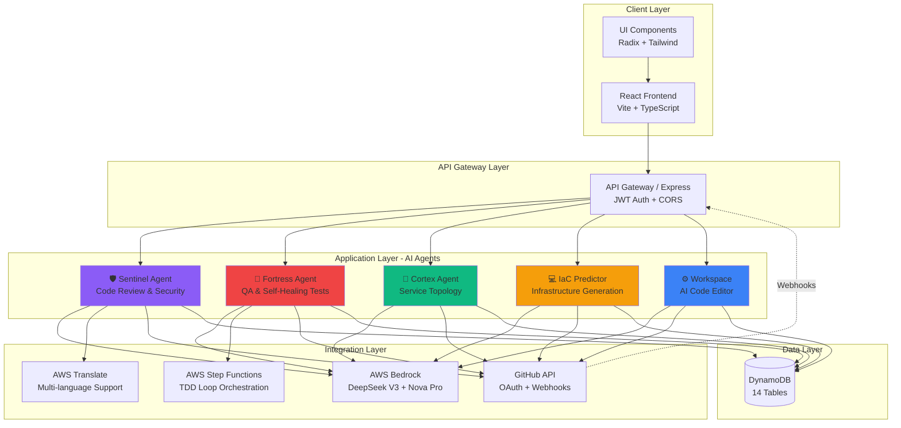

---

## 2. User Authentication Flow

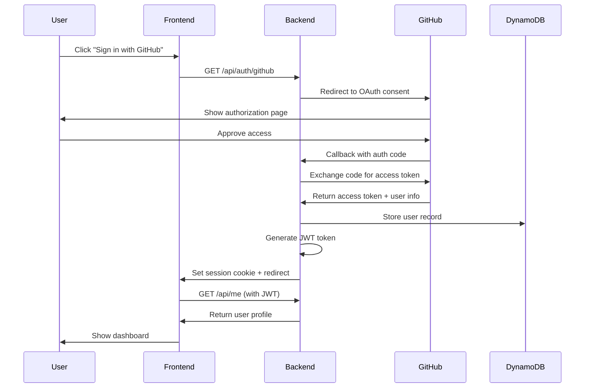

---

## 3. Repository Installation & Onboarding Flow

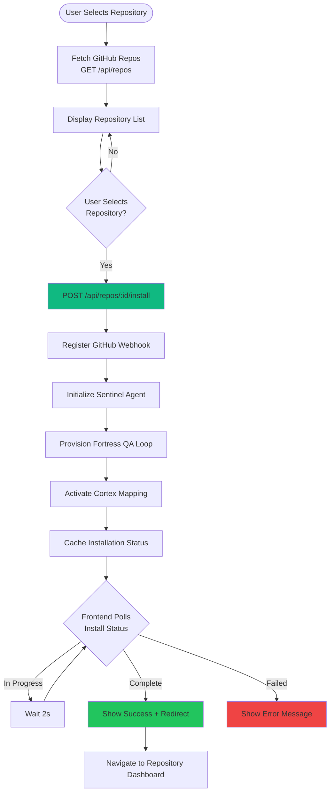

---

## 4. Sentinel Agent - Code Review Workflow

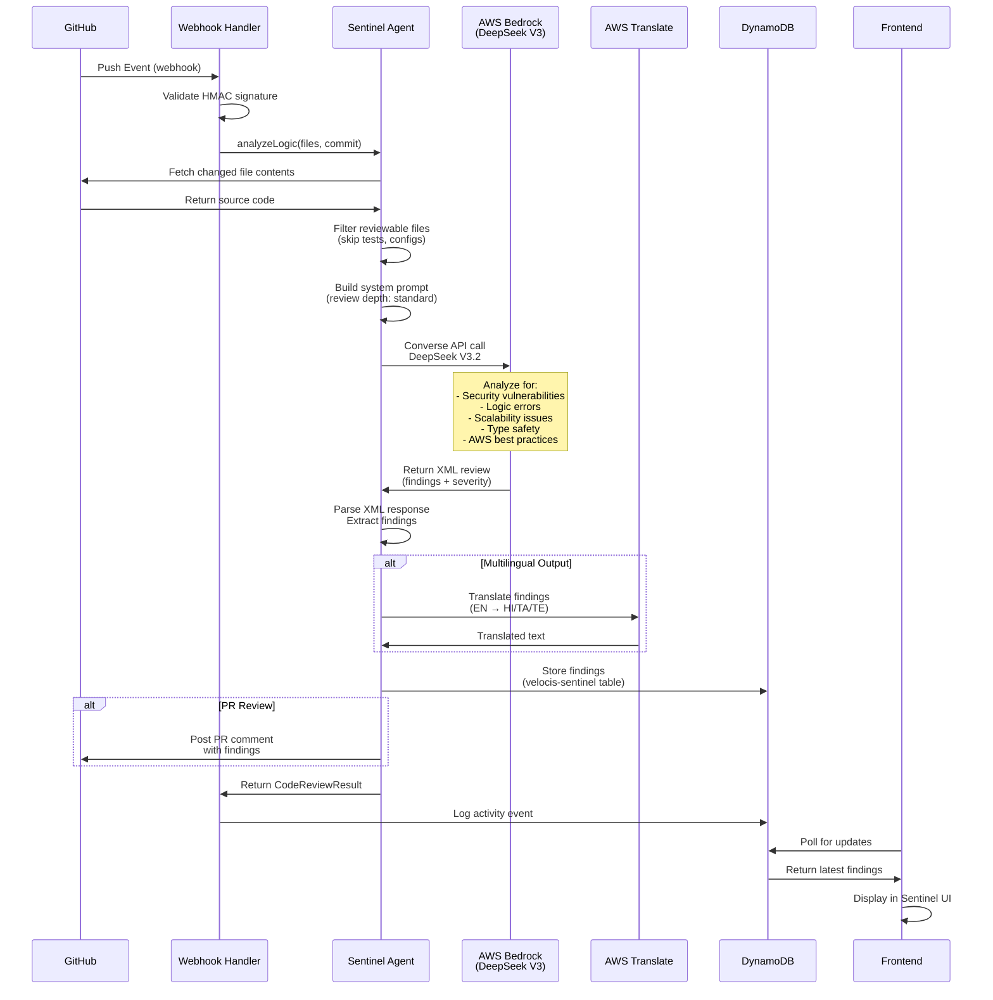

---

## 5. Fortress Agent - Self-Healing QA Pipeline

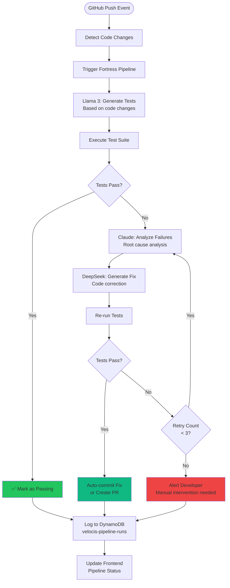

---

## 6. Fortress TDD Loop - Step Functions Orchestration

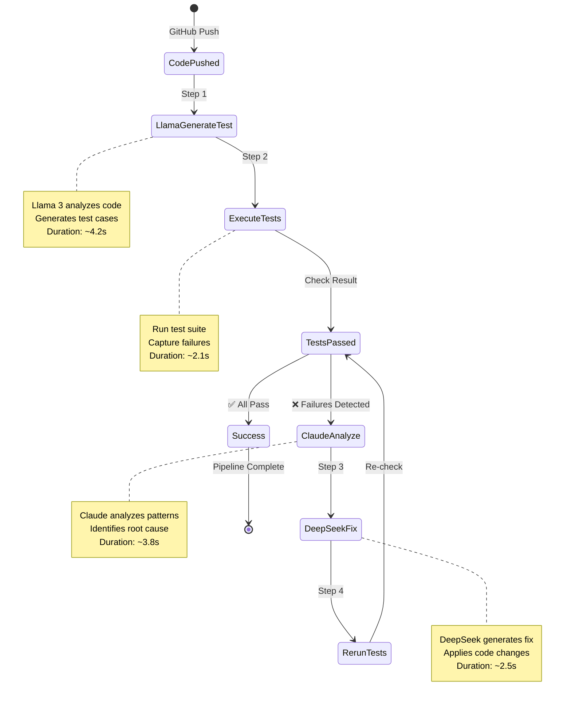

---

## 7. Cortex Agent - Service Topology Mapping

```mermaid
flowchart LR
    subgraph "Step 1: Discovery"
        FETCH[Fetch Repo Tree<br/>from GitHub]
        FILTER[Filter Code Files<br/>Skip node_modules, tests]
    end
    
    subgraph "Step 2: Analysis"
        AI[AI Analysis<br/>DeepSeek V3]
        REGEX[Regex Fallback<br/>Extract imports]
        MERGE[Merge Results]
    end
    
    subgraph "Step 3: Graph Building"
        NODES[Build Nodes<br/>File metadata + LOC]
        EDGES[Build Edges<br/>Import relationships]
        HEALTH[Integrate Health<br/>From Fortress]
    end
    
    subgraph "Step 4: Positioning"
        LAYER[Layer Assignment<br/>Infrastructure → Handlers]
        POSITION[3D Coordinates<br/>Radial layout]
    end
    
    subgraph "Step 5: Caching"
        CACHE[(DynamoDB Cache<br/>5-minute TTL)]
    end
    
    FETCH --> FILTER
    FILTER --> AI
    FILTER --> REGEX
    AI --> MERGE
    REGEX --> MERGE
    MERGE --> NODES
    NODES --> EDGES
    EDGES --> HEALTH
    HEALTH --> LAYER
    LAYER --> POSITION
    POSITION --> CACHE
    CACHE --> FRONTEND[Frontend 3D Visualization]
    
    style AI fill:#8b5cf6
    style CACHE fill:#3b82f6
    style FRONTEND fill:#10b981
```

---

## 8. IaC Predictor - Infrastructure Generation Flow

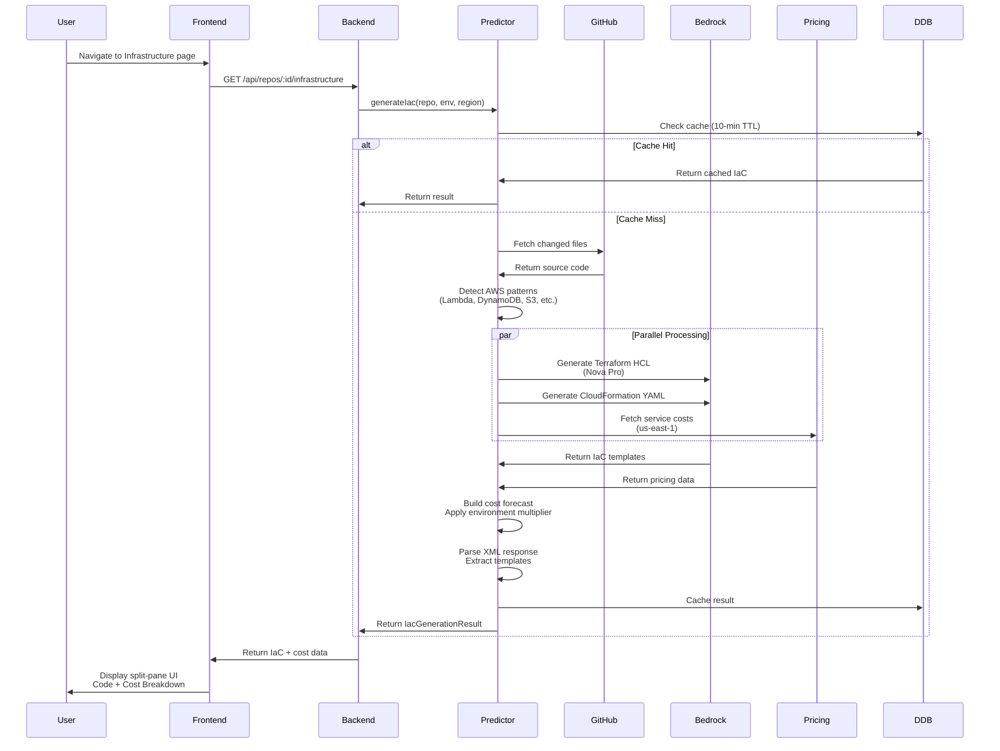

---

## 9. Workspace - AI Code Editor Flow

```mermaid
flowchart TD
    START([User Opens Workspace]) --> LOAD[Load File Browser]
    LOAD --> FETCH[Fetch Repo Files<br/>GET /workspace/files]
    FETCH --> DISPLAY[Display Monaco Editor]
    
    DISPLAY --> SELECT{User Action?}
    
    SELECT -->|Open File| CONTENT[GET /workspace/files/content]
    CONTENT --> RENDER[Render in Monaco]
    RENDER --> ANNOTATIONS[GET /workspace/annotations]
    ANNOTATIONS --> HIGHLIGHT[Highlight Issues Inline]
    
    SELECT -->|Chat with AI| CHAT[POST /workspace/chat]
    CHAT --> BEDROCK[AWS Bedrock<br/>Sentinel Mentor]
    BEDROCK --> STREAM[Stream Response]
    STREAM --> CHATUI[Display in Chat Panel]
    
    SELECT -->|Edit Code| EDIT[User Edits in Monaco]
    EDIT --> SAVE{Save Changes?}
    SAVE -->|Yes| PUSH[POST /workspace/push]
    PUSH --> GITHUB[Commit to GitHub]
    GITHUB --> WEBHOOK[Trigger Webhook]
    WEBHOOK --> SENTINEL[Sentinel Re-scan]
    
    SELECT -->|Review Codebase| REVIEW[POST /workspace/review]
    REVIEW --> FULLSCAN[Full Codebase Scan]
    FULLSCAN --> RESULTS[Display Review Results]
    
    HIGHLIGHT --> SELECT
    CHATUI --> SELECT
    RESULTS --> SELECT
    SENTINEL --> SELECT
    
    style BEDROCK fill:#8b5cf6
    style GITHUB fill:#000
    style SENTINEL fill:#ef4444
```

---

## 10. Dashboard Aggregation Flow

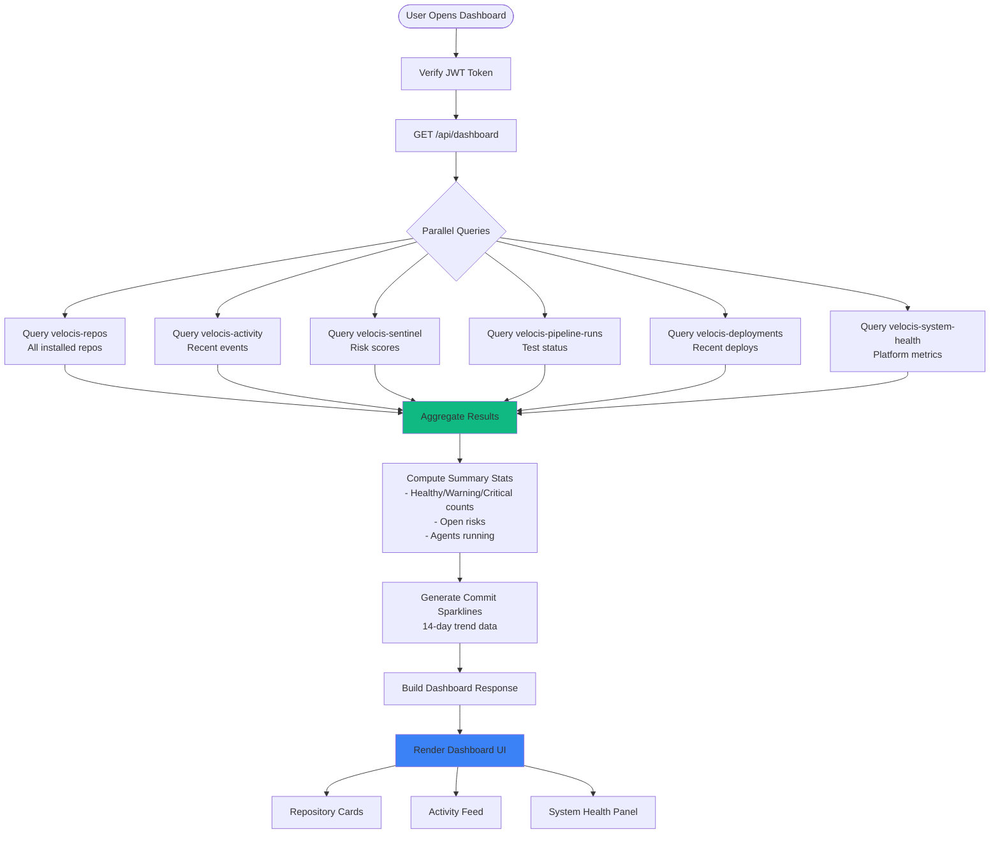

---

## 11. GitHub Webhook Processing

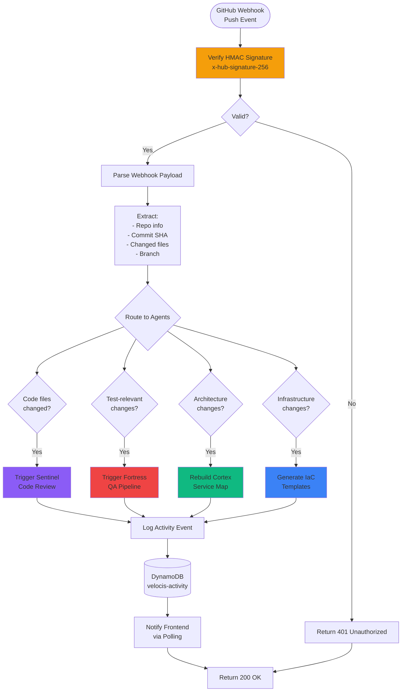

---

## 12. Data Flow - DynamoDB Tables

```mermaid
erDiagram
    USERS ||--o{ REPOS : installs
    REPOS ||--o{ SENTINEL : has
    REPOS ||--o{ PIPELINE_RUNS : has
    REPOS ||--o{ CORTEX : has
    REPOS ||--o{ ACTIVITY : generates
    REPOS ||--o{ ANNOTATIONS : has
    REPOS ||--o{ WORKSPACE_CHAT : has
    REPOS ||--o{ IAC : has
    REPOS ||--o{ DEPLOYMENTS : has
    
    USERS {
        string userId PK
        string githubId
        string login
        string email
        string avatarUrl
        timestamp createdAt
    }
    
    REPOS {
        string repoId PK
        string userId FK
        string repoName
        string repoOwner
        string visibility
        string language
        timestamp installedAt
    }
    
    SENTINEL {
        string repoId PK
        string commitSha SK
        string overallRisk
        int criticalFindings
        json findings
        timestamp reviewedAt
    }
    
    PIPELINE_RUNS {
        string repoId PK
        string runId SK
        string status
        json steps
        json testResults
        timestamp startedAt
    }
    
    CORTEX {
        string repoId PK
        string graphId SK
        json nodes
        json edges
        string overallHealth
        timestamp generatedAt
    }
    
    ACTIVITY {
        string repoId PK
        timestamp timestamp SK
        string agent
        string message
        string severity
    }
    
    ANNOTATIONS {
        string repoId PK
        string annotationId SK
        string filePath
        int line
        string type
        string message
        json suggestions
    }
    
    WORKSPACE_CHAT {
        string repoId PK
        string messageId SK
        string role
        string content
        timestamp timestamp
    }
    
    IAC {
        string repoId PK
        string commitSha SK
        string terraformCode
        string cloudformationCode
        json costForecast
        timestamp generatedAt
    }
    
    DEPLOYMENTS {
        string repoId PK
        timestamp deployedAt SK
        string environment
        string status
        string commitSha
    }
```

---

## 13. AI Model Selection Strategy

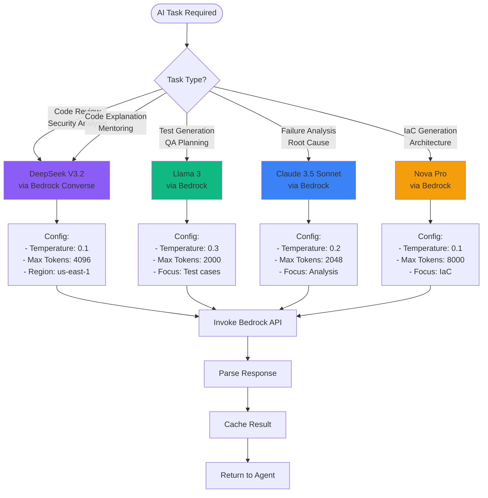

---

## 14. Cost Optimization Flow

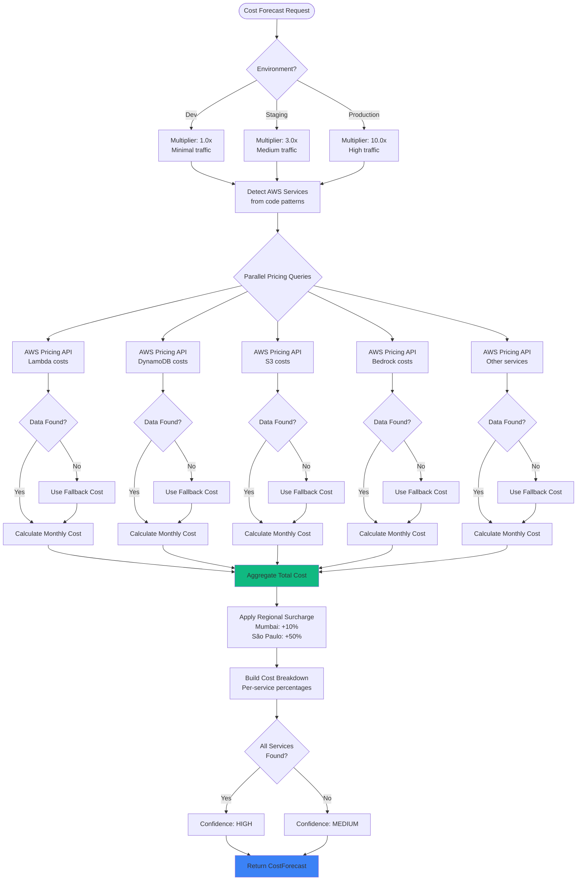

---

## 15. Error Handling & Retry Strategy

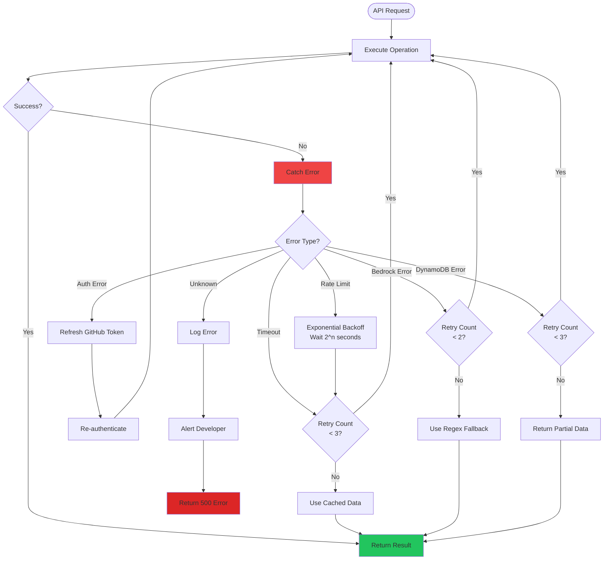

---

## Summary

This comprehensive process flow diagram covers:

1. **System Architecture** - High-level component interaction
2. **Authentication** - GitHub OAuth flow
3. **Repository Onboarding** - Installation and setup
4. **Sentinel Agent** - AI code review workflow
5. **Fortress Agent** - Self-healing QA pipeline
6. **TDD Loop** - Step Functions orchestration
7. **Cortex Agent** - Service topology mapping
8. **IaC Predictor** - Infrastructure generation
9. **Workspace** - AI code editor
10. **Dashboard** - Data aggregation
11. **Webhooks** - GitHub event processing
12. **Data Model** - DynamoDB schema
13. **AI Strategy** - Model selection logic
14. **Cost Optimization** - Pricing calculation
15. **Error Handling** - Retry and fallback strategies

The Velocis platform is a sophisticated AI-powered engineering system that combines multiple AI models (DeepSeek V3, Llama 3, Claude, Nova Pro) with AWS serverless infrastructure to provide autonomous code review, self-healing tests, architecture visualization, and infrastructure generation capabilities.
